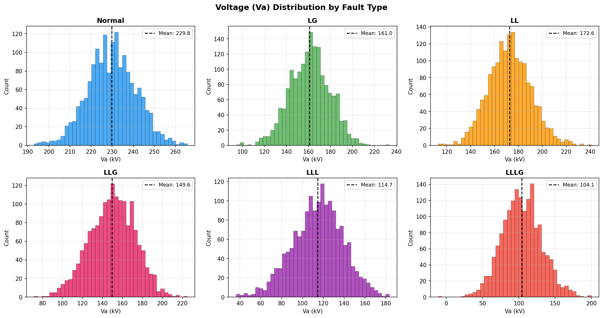
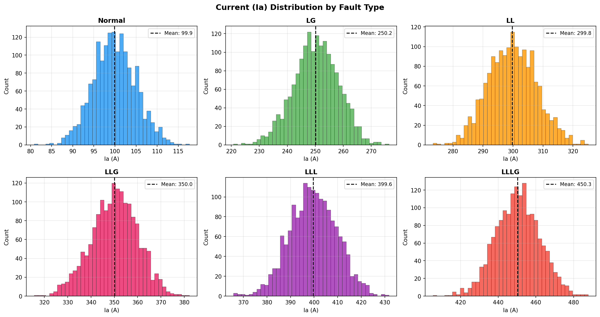
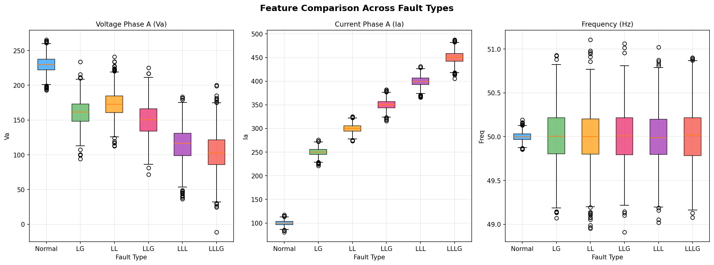
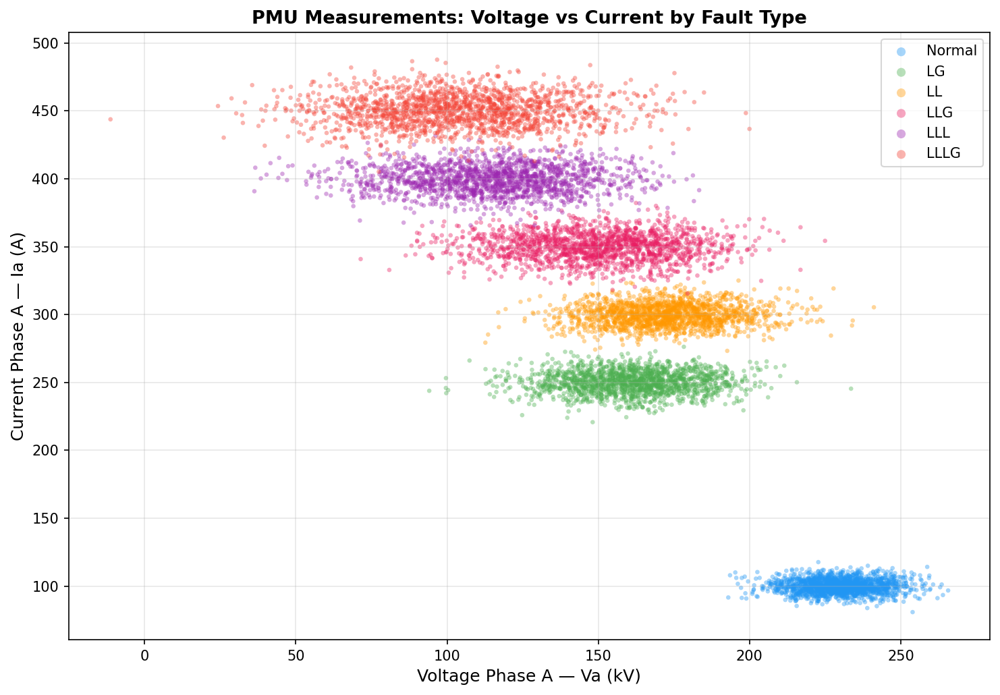
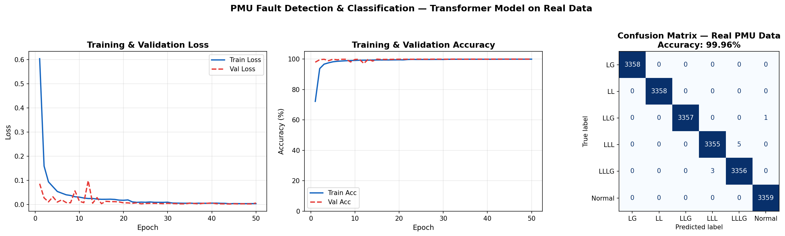
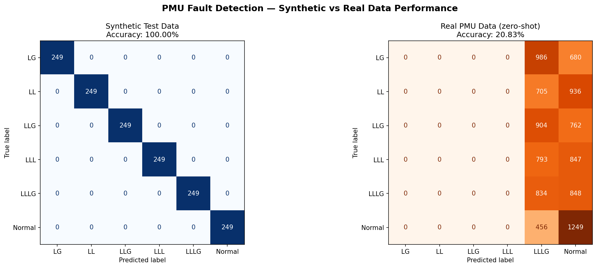
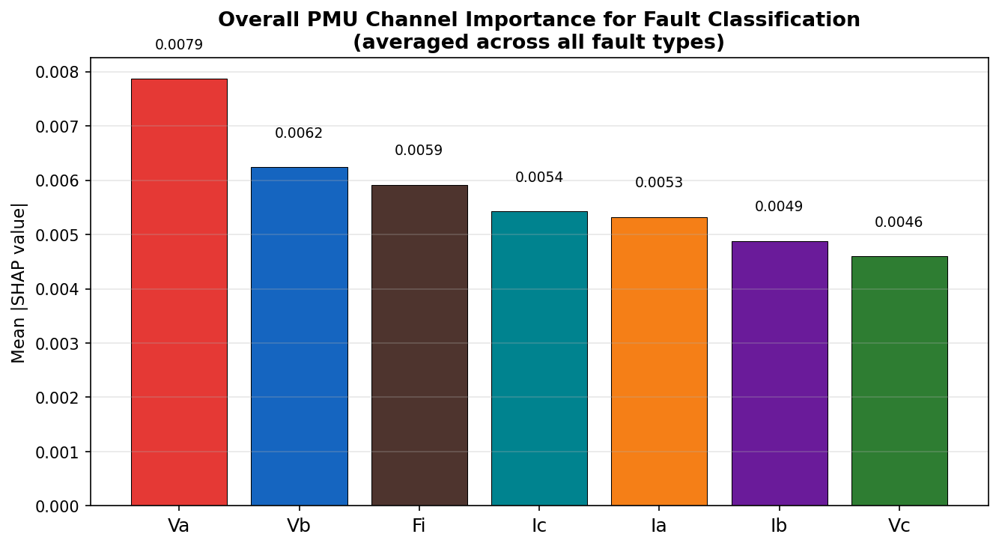
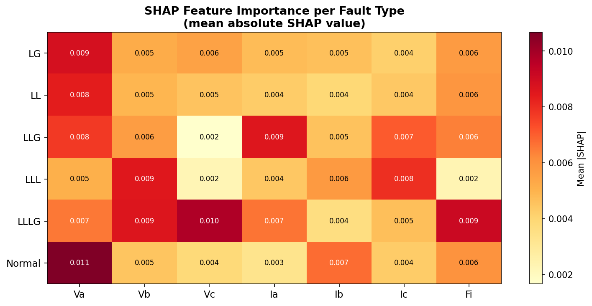
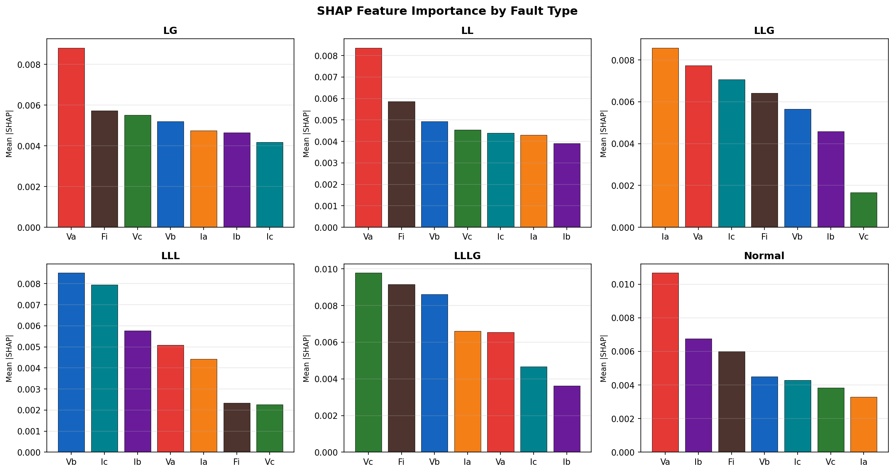

# Real-Time Power Grid Fault Detection and Classification using Transformer Networks on PMU Measurements

A three-stage deep learning pipeline for fault detection, classification, and explainability
using real Phasor Measurement Unit (PMU) data from a transmission line simulation.

## Project Overview

Power grids are monitored using Phasor Measurement Units (PMUs), which capture
synchronized high-frequency measurements of voltage, current, and frequency across
the grid. When faults occur , such as line-to-ground faults, three-phase faults, or
double line-to-ground faults ,  these measurements exhibit distinctive temporal
signatures that traditional protection systems are slow to interpret.

This project builds a three-stage AI pipeline:

**Stage 1 - Fault Detection**
A binary view of the classifier output that distinguishes normal grid operation
from any fault condition in real time.

**Stage 2 - Fault Classification**
A Transformer-based multi-class model that identifies the specific fault type
from a sliding window of PMU measurements.

**Stage 3 - Explainability**
SHAP analysis that identifies which PMU channels contributed most to each
classification decision, providing interpretable outputs for grid operators.

---

## Fault Types Classified

| Label  | Description               |
|--------|---------------------------|
| Normal | No fault (NF)             |
| LG     | Single line-to-ground     |
| LL     | Line-to-line              |
| LLG    | Double line-to-ground     |
| LLL    | Three-phase               |
| LLLG   | Three-phase-to-ground     |

---

## Dataset

**Real dataset:** PMU Transmission Line Fault Dataset
Published by researchers from North South University, Virginia Tech,
and the University of British Columbia.
Source: [Zenodo DOI 10.5281/zenodo.8214226](https://zenodo.org/records/8214226)
Format: 134,406 samples × 13 PMU channels, 6 fault types, perfectly balanced.

**Synthetic dataset:** Generated using realistic per-class voltage and current
signatures for initial model development and comparison.

---

## Model Architecture
```

Input: (batch_size, 10 timesteps, 7 PMU features)
↓
Linear projection → d_model=64
↓
Positional Encoding
↓
Transformer Encoder (2 layers, 4 attention heads)
↓
Global Average Pooling
↓
Classification Head → 6 fault type probabilities

**Total parameters:** 72,006

**PMU features used:**
- Va, Vb, Vc — Voltage magnitude (phases A, B, C)
- Ia, Ib, Ic — Current magnitude (phases A, B, C)
- Fi — Frequency of current

---

---
```
## Results Summary

| Dataset        | Accuracy |
|----------------|----------|
| Synthetic data | 100.00%  |
| Real PMU data  | 99.96%   |

---

## Results

### Voltage Distribution by Fault Type


### Current Distribution by Fault Type


### Feature Boxplots


### Voltage vs Current by Fault Type


### Training Curves and Confusion Matrix


### Synthetic vs Real Data Performance


### SHAP Feature Importance — Overall


### SHAP Feature Importance — Heatmap


### SHAP Feature Importance — Per Fault Type


---

## SHAP Explainability Findings

SHAP (SHapley Additive exPlanations) analysis identifies which PMU channels
drive each fault classification decision.

**Key findings:**
- **Va (Voltage Phase A)** is the most influential feature overall - top contributor
  for LG, LL, and Normal classification
- **Fi (Frequency)** appears in the top 3 for LG, LL, LLG, LLLG, and Normal,
  confirming that frequency deviation is a reliable fault indicator
- **Current channels (Ia, Ib, Ic)** become more important for multi-phase faults
  (LLG, LLL, LLLG) where voltage signatures alone are insufficient
- **Vc (Voltage Phase C)** is the top contributor for LLLG - the most severe fault type

This per-class explainability is directly useful for grid operators who need to
understand which sensors triggered a fault alarm.

---

## Project Structure
```
pmu-fault-detection/
├── data/
│   ├── download_data.py          # Synthetic dataset generator
│   ├── download_real_data.py     # Real dataset downloader (Zenodo)
│   ├── preprocess.py             # Preprocessing for synthetic data
│   ├── preprocess_real.py        # Preprocessing for real data
│   ├── explore_data.py           # Data visualization
│   └── processed_real/           # Preprocessed arrays (.npy)
├── models/
│   ├── transformer_model.py      # Transformer architecture
│   ├── train.py                  # Training on synthetic data
│   ├── train_real.py             # Training on real data
│   └── saved_real/               # Best model checkpoint
├── evaluation/
│   ├── evaluate_real.py          # Confusion matrix + training curves
│   └── shap_explain.py           # SHAP explainability analysis
├── results/                      # All saved plots
└── README.md

```
---

## How to Run

```bash
# 1. Create environment
conda create -n pmu-fault python=3.10
conda activate pmu-fault
pip install torch numpy pandas matplotlib scikit-learn shap requests jupyter

# 2. Download and preprocess real data
python data/download_real_data.py
python data/preprocess_real.py

# 3. Train on real data
python models/train_real.py

# 4. Evaluate
python evaluation/evaluate_real.py

# 5. SHAP explainability
python evaluation/shap_explain.py
```

---

## Technologies

Python · PyTorch · Transformer Networks · SHAP · Scikit-learn ·
Time-Series Classification · Power Systems · PMU Data

---

## Limitations and Future Work

- The real dataset was generated using MATLAB Simulink simulation tools.
  Evaluation on live operational grid data (e.g. FNET/GridEye) would further
  validate real-world deployment readiness.
- The current model uses 7 of the 13 available PMU channels. Incorporating
  the remaining channels (Im, Vm, Pai, Pav, Fv) may improve performance on
  edge cases.
- Future work includes online/streaming inference for true real-time deployment
  and testing under noisy or missing measurement conditions.

